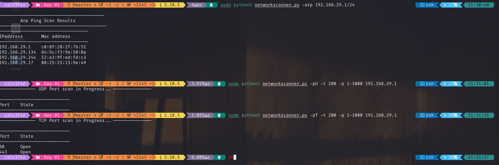

# Description
Networkscanner is a Network Scanner which for now provides functionalities like 
- Arp Ping Scan
- Tcp Port Scan
- Udp Port Scan 

**Note:- UDP Scan for now only works on url provided**

## Resources Used !
- Writeup for Arp scanner by Dharmil Chhadva | [Link](https://levelup.gitconnected.com/writing-a-network-scanner-using-python-a41273baf1e2)
- Writeup on How to Build Command Line Interfaces in Python With argparse by Davide Mastromatteo  | [Link](https://realpython.com/command-line-interfaces-python-argparse/)
- Video on Threading In python (using Lock&queue in threading)| [Link](https://www.youtube.com/watch?v=usyg5vbni34&ab_channel=PythonEngineer)
- How to built a UDP port scanner | [Link](https://stackoverflow.com/questions/42867192/python-check-udp-port-open)
- Writeup on Daemon Thread vs Non-Daemon Thread | [Link](https://www.geeksforgeeks.org/python-daemon-threads/)