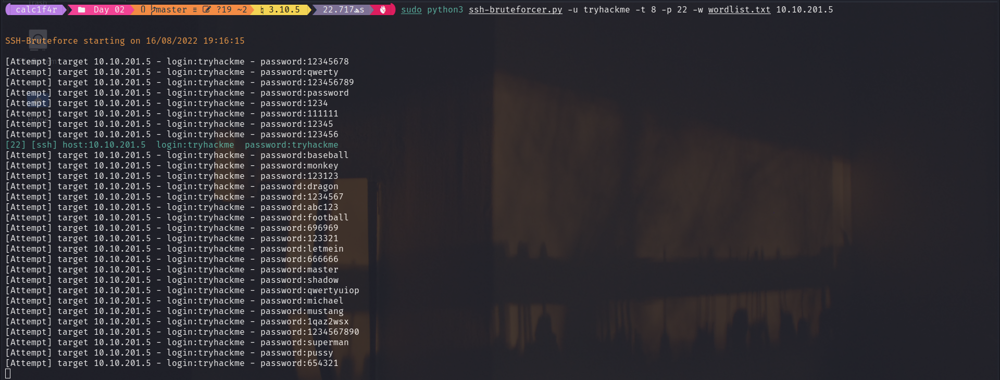

# Description 
SSH-Bruteforcer as the name suggests a mulithreaded ssh bruteforcer which for now supports 8 threads!
which takes host and username as input ! 

**Note=> For now it only supports 8 threads**
## Learnings 
- How to use Paramiko for connecting to client and send commands 

## Resources Used 
- Documentation of Paramiko | [Code](https://www.paramiko.org/)
- Article on How to Execute Shell Commands in a Remote Machine using Python | [Code](https://www.geeksforgeeks.org/how-to-execute-shell-commands-in-a-remote-machine-using-python-paramiko/)