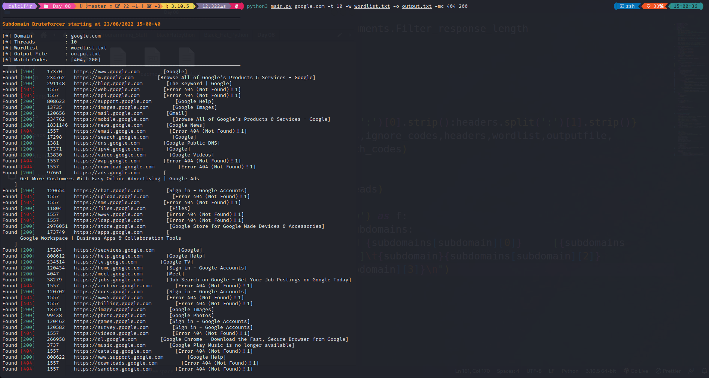

# Description
Subdomain Bruteforcer is a multithreaded Subdomain Bruteforcer which supports various features which are mentioned below!

## Help menu
```
usage: main.py [-h] [-t THREADS] [-w WORDLIST] [--ignore-code [IGNORE_CODES ...]] [-mc [MATCH_CODES ...]]
               [-fl FILTER_RESPONSE_LENGTH] [-header HEADERS] [-o OUTPUT] [-disable-redirect]
               domain

positional arguments:
  domain                target to scan

options:
  -h, --help            show this help message and exit
  -t THREADS, -threads THREADS
                        Specify the threads, (Default => 10)
  -w WORDLIST, --wordlist WORDLIST
                        Specify the wordlist to use !
  --ignore-code [IGNORE_CODES ...]
                        Codes to ignore
  -mc [MATCH_CODES ...]
                        Status Codes to ignore
  -fl FILTER_RESPONSE_LENGTH
                        Filter the response length
  -header HEADERS       Additional headers
  -o OUTPUT             File to output into
  -disable-redirect     Disable redirection,Default : Redirection True
```
## Learnings 
- How to use requests module and send get redirects and how to handle their exception 
## Resources Used 
- Request Module Official documentation | [Link](https://requests.readthedocs.io/en/latest/)