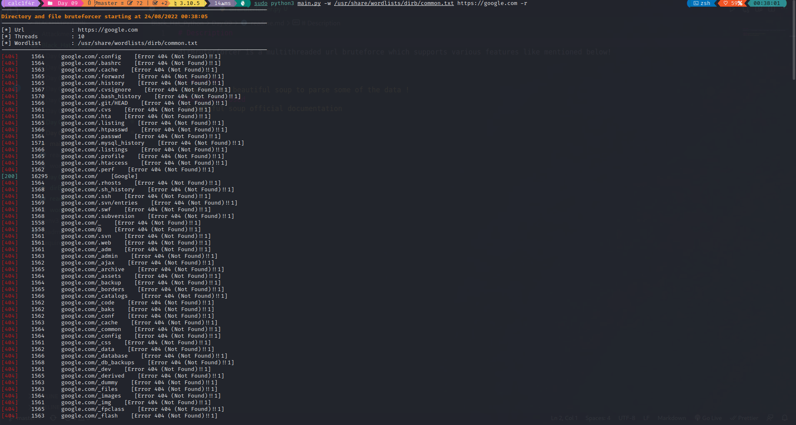

# Description 

dirBruterforcer is a multithreaded url bruteforce which supports various features like mentioned below!
```
usage: dirBruterforcer.py [-h] [-x [EXTENSIONS ...]] [-r] [-H [HEADER ...]] [-a string] [-t THREADS] [-ht] [-mc [MATCH_CODES ...]] [-ms [MATCH_SIZE ...]] [-fc [FILTER_CODES ...]]
                          [-fs [FILTER_SIZE ...]] -w WORDLIST [-o OUTPUT]
                          target

positional arguments:
  target                The target to attack on provide it with http or https

options:
  -h, --help            show this help message and exit
  -x [EXTENSIONS ...]   Extension list separated by space and without dot (Example: php asp)
  -r, --follow-redirect
                        Follow redirects
  -H [HEADER ...], --headers [HEADER ...]
                        Specify HTTP headers, -H 'Header1: val1' -H 'Header2: val2'
  -a string, --useragent string
                        Set the User-Agent string (default 'directorybuster/1.0')
  -t THREADS, --threads THREADS
                        Number of threads
  -ht, --hide-title     Specify for hiding response title in output
  -mc [MATCH_CODES ...]
                        Include status codes, separated by space, example -mc 200 404
  -ms [MATCH_SIZE ...]  Match amount of size in response
  -fc [FILTER_CODES ...]
                        Filter the status codes (provide space separated values
  -fs [FILTER_SIZE ...]
                        Filter the response size (provide space separated values
  -w WORDLIST, --wordlist WORDLIST
                        Wordlist to use
  -o OUTPUT, --output OUTPUT
                        Output file to use!
```
# Learning 
- How to use beautiful soup to parse some of the data ! 
# Resources Used 
- Beautiful soup official documentation | [Link](https://www.crummy.com/software/BeautifulSoup/bs4/doc/)